# 보수학당 (Conservative Academy)

> 보수주의 사상과 철학을 체계적으로 배울 수 있는 무료 교육 플랫폼

🔗 [라이브 데모](https://conservatism-platform.vercel.app/)

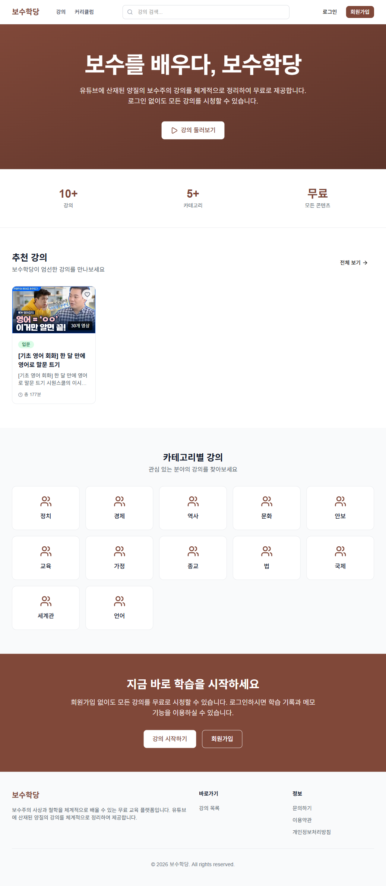

## 프로젝트 소개

유튜브에 산재된 양질의 보수주의 강의를 체계적으로 정리하여 무료로 제공하는 교육 플랫폼입니다. 로그인 없이도 모든 강의를 시청할 수 있으며, 회원가입 시 학습 기록, 메모, 즐겨찾기 기능을 이용할 수 있습니다.

## 기술 스택

| 분류 | 기술 |
|------|------|
| 프레임워크 | Next.js 16 (App Router) |
| UI | React 19, Tailwind CSS 4 |
| 언어 | TypeScript |
| 백엔드/DB | Supabase (PostgreSQL, Auth, RLS) |
| 상태 관리 | Zustand (클라이언트), TanStack Query (서버) |
| 폼 검증 | React Hook Form + Zod |
| 이메일 | Nodemailer |
| 배포 | Vercel |

## 주요 기능

### 1. 강의 목록 및 필터링

카테고리, 난이도별 필터링과 검색 기능을 제공합니다. 페이지네이션으로 대량의 강의를 효율적으로 탐색할 수 있습니다.

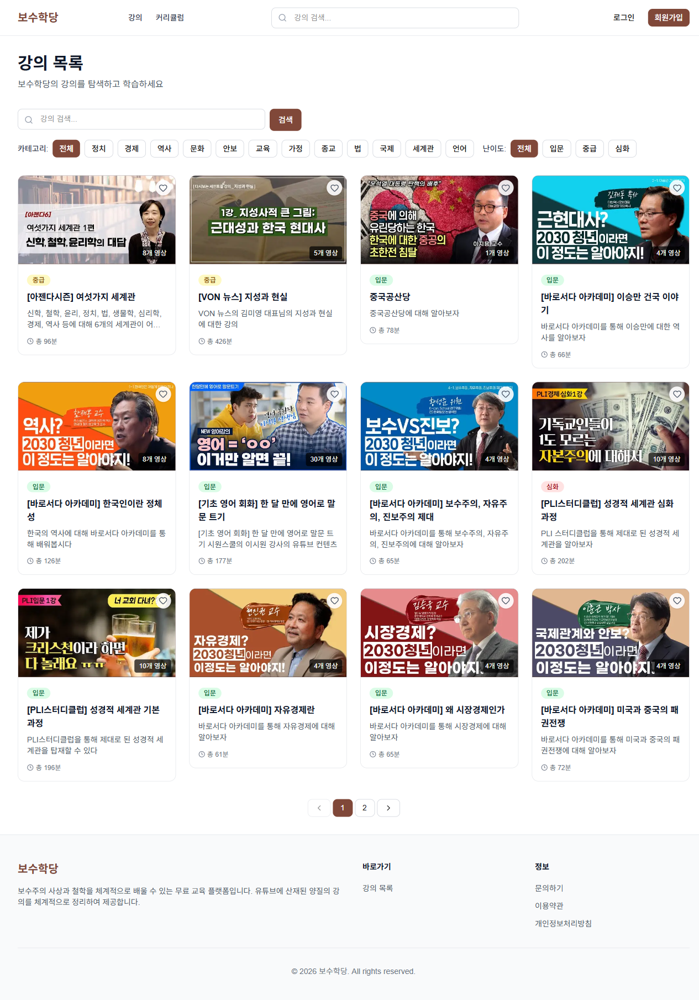

### 2. 강의 상세 및 유튜브 플레이어

유튜브 영상을 임베드하여 플랫폼 내에서 바로 시청할 수 있습니다. 영상 목록, 메모 기능, 공유 버튼을 제공합니다.


### 3. 커리큘럼

여러 강의를 체계적으로 묶어 학습 경로를 제공합니다. 난이도별로 분류되어 있어 단계적 학습이 가능합니다.


### 4. 인증 시스템

이메일 기반 회원가입/로그인, 이메일 인증, 비밀번호 재설정을 지원합니다.

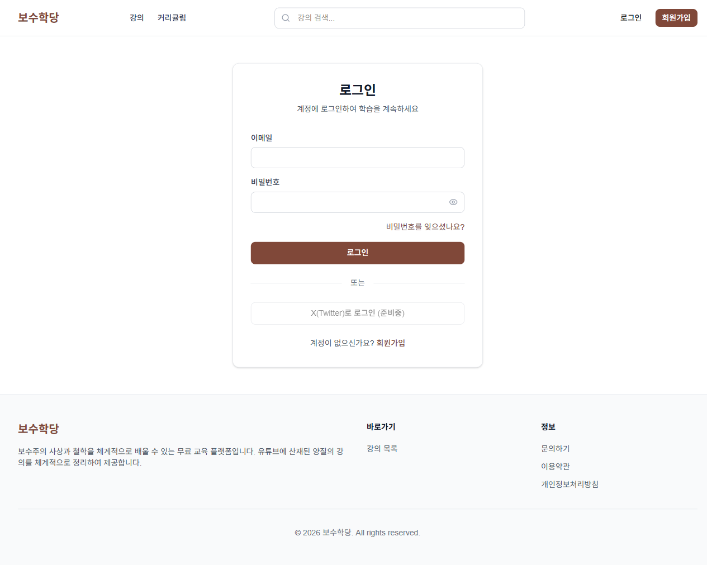
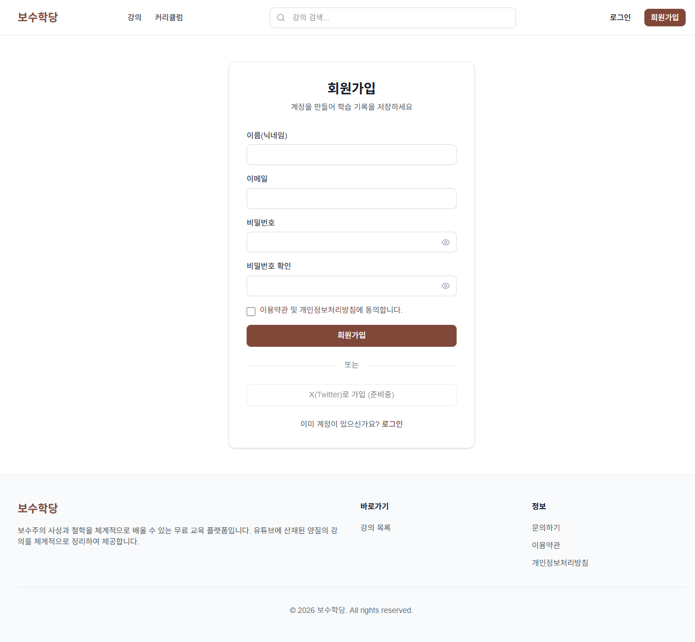

### 5. 관리자 대시보드

관리자 전용 페이지에서 영상, 강의, 커리큘럼, 카테고리, 멤버를 CRUD 관리할 수 있습니다.

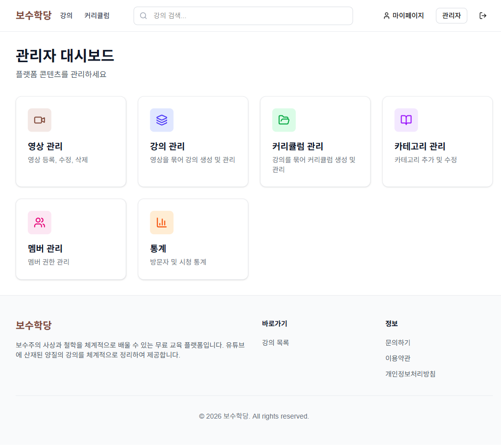

주요 관리 기능:
- 영상 관리 (YouTube URL로 등록, 메타데이터 자동 추출)
- 강의 관리 (영상을 묶어 강의 생성, 순서 지정)
- 커리큘럼 관리 (강의를 묶어 커리큘럼 생성)
- 카테고리 관리
- 멤버 권한 관리
- 통계 대시보드

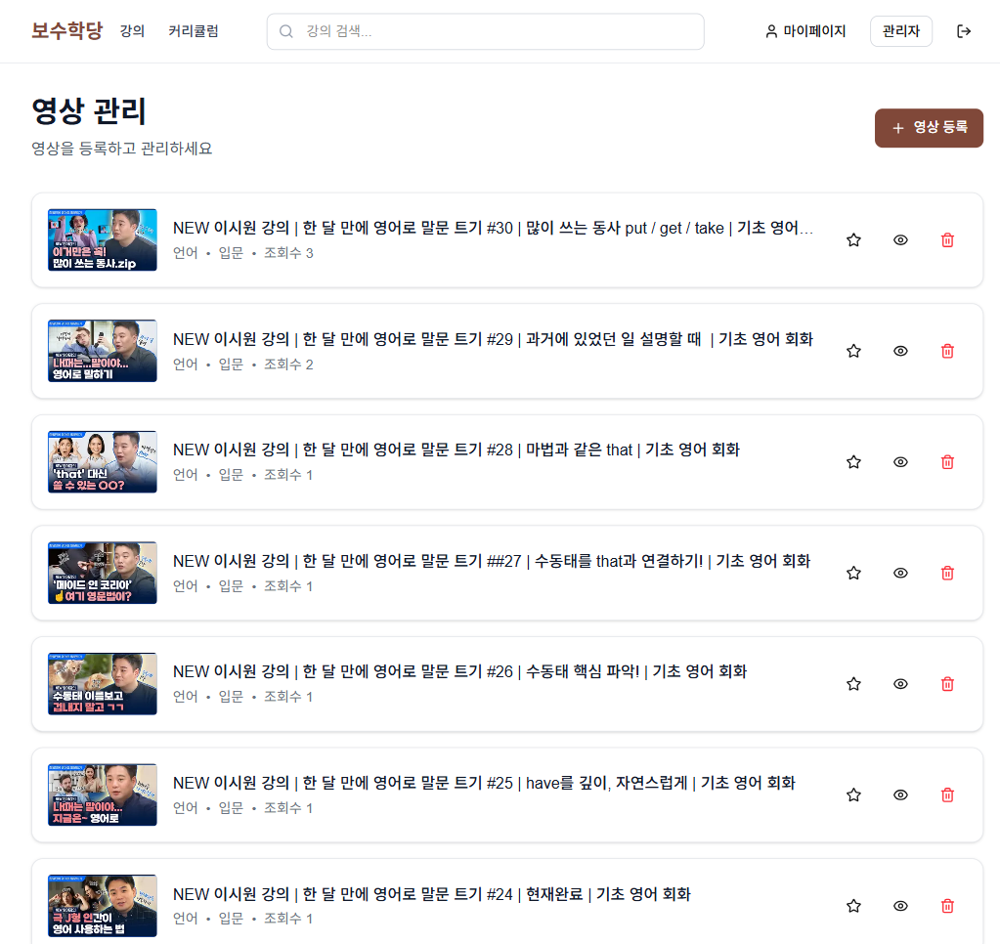
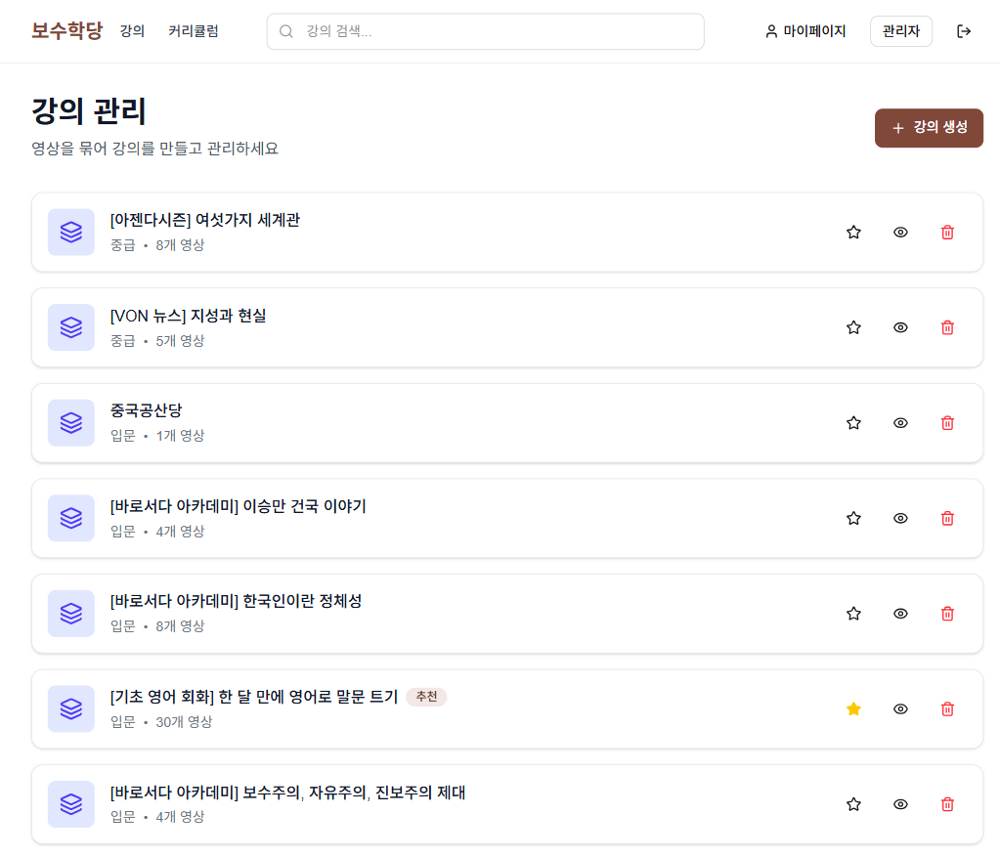

### 6. 반응형 디자인

모바일, 태블릿, 데스크톱 모든 환경에서 최적화된 UI를 제공합니다.

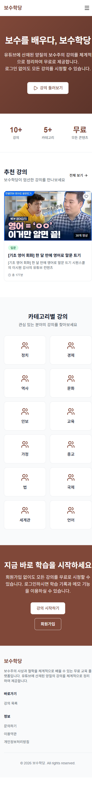

### 7. 추가 기능

- 강의 메모 (타임스탬프 기반)
- 즐겨찾기
- 시청 기록 추적
- 강의 검색 (헤더 통합 검색)
- 문의하기 페이지
- 마이페이지 (학습 기록, 메모 관리)

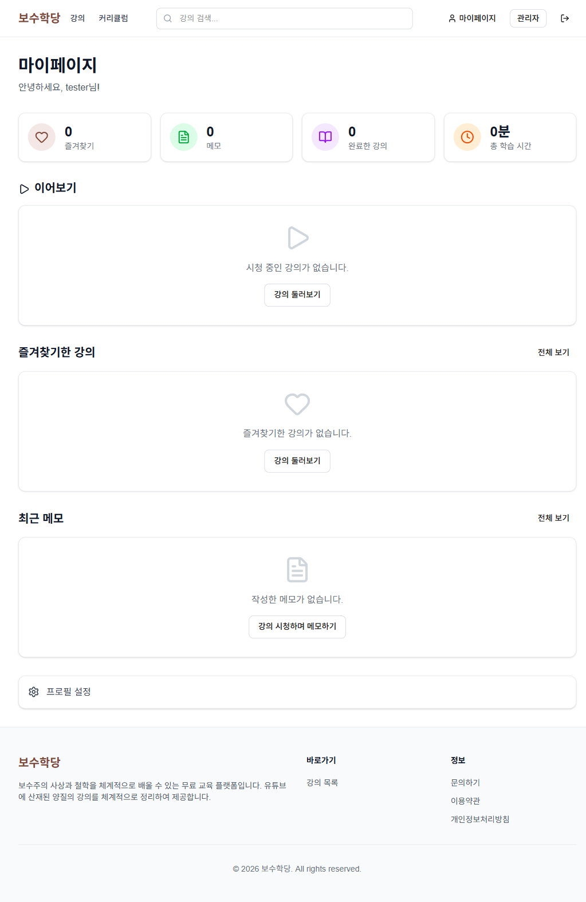
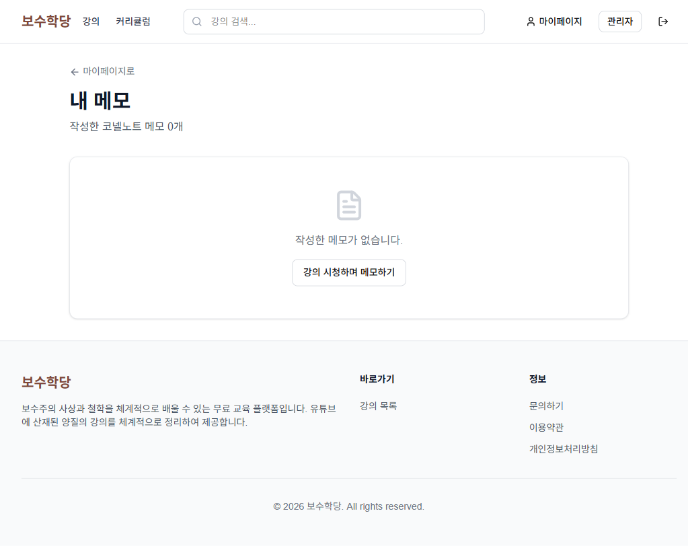
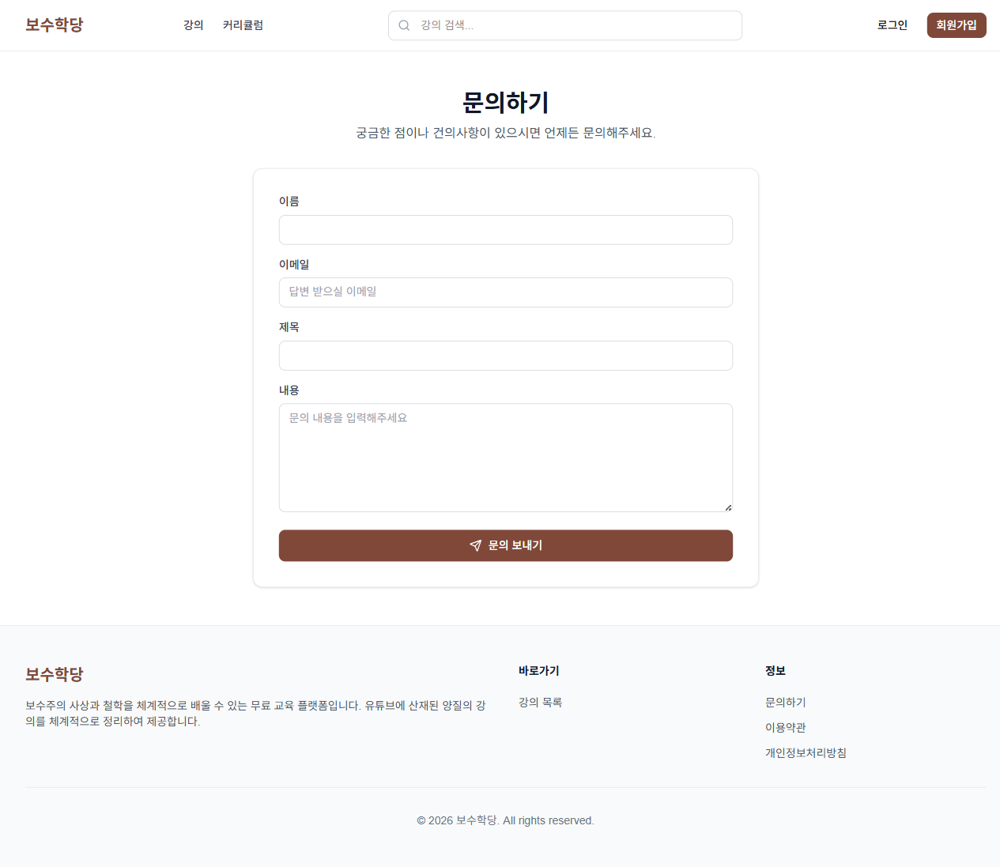

## 아키텍처

```
src/
├── app/              # Next.js App Router (서버 컴포넌트 기본)
│   ├── (auth)/       # 인증 (로그인, 회원가입, 비밀번호 재설정)
│   ├── admin/        # 관리자 CRUD (클라이언트 컴포넌트)
│   ├── api/          # API 라우트 (이메일 인증, 유저 삭제)
│   ├── lectures/     # 강의 목록/상세
│   ├── curriculums/  # 커리큘럼 목록/상세
│   └── mypage/       # 마이페이지 (메모, 설정)
├── components/       # 재사용 컴포넌트
│   ├── ui/           # 기본 UI (Button, Card, Modal, Pagination 등)
│   ├── layout/       # Header, Footer
│   └── lectures/     # 강의 카드, 유튜브 플레이어
├── hooks/            # TanStack Query 기반 커스텀 훅
├── lib/supabase/     # Supabase 클라이언트 (브라우저/서버/관리자)
├── providers/        # Auth, Query 프로바이더
├── stores/           # Zustand 스토어 (인증, 플레이어 상태)
└── types/            # TypeScript 타입 정의
```

## 핵심 설계 결정

- 서버 컴포넌트 우선: SEO와 초기 로딩 성능을 위해 서버 컴포넌트를 기본으로 사용
- RLS (Row Level Security): Supabase RLS로 데이터 접근 제어
- 이메일 인증: Nodemailer + 커스텀 인증 플로우로 이메일 검증
- 상태 분리: 서버 상태(TanStack Query)와 클라이언트 상태(Zustand)를 명확히 분리
- 타입 안전성: Supabase 자동 생성 타입으로 DB 스키마와 코드 동기화

## 실행 방법

```bash
# 의존성 설치
npm install

# 환경 변수 설정
cp .env.local.example .env.local
# .env.local에 Supabase, SMTP 등 설정

# 개발 서버 실행
npm run dev
```

## 라이선스

Private Project
